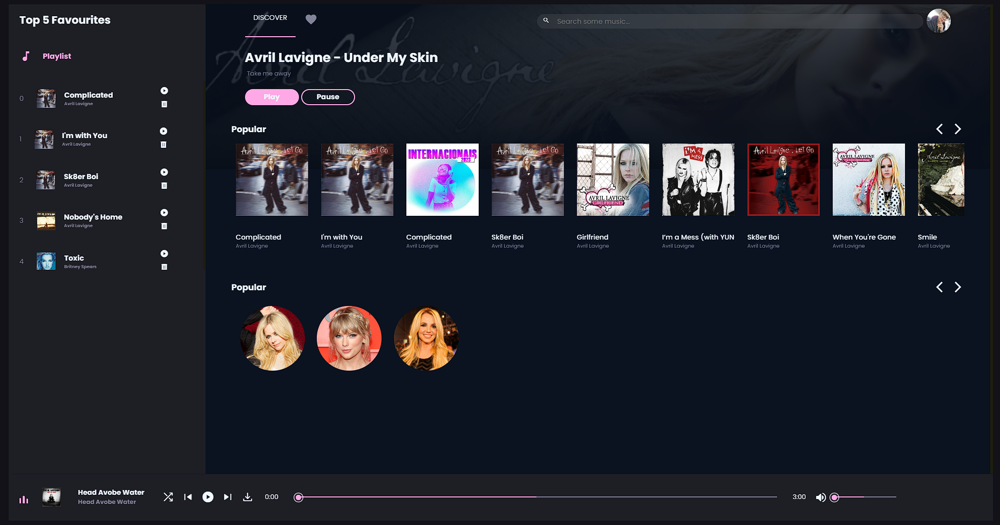
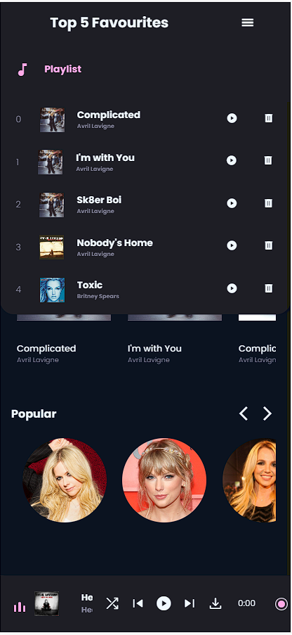

# ReproductorMusica
Reproductor de Musica creado con JavaScript, CSS y HTML, utiliza la api publica de Deezer para obtener las canciones

16 / 06 / 23
- Cuenta con Versión Móvil
- Límite de 5 favoritas
- Uso de la API publica de Deezer
- Buscador de canciones 
- Animación de doble click para agregar a favoritas
***
Correcciones a Implementar:
- Mostrar controles en versión móvil
- Mostrar una lista de Artistas mas completa

 